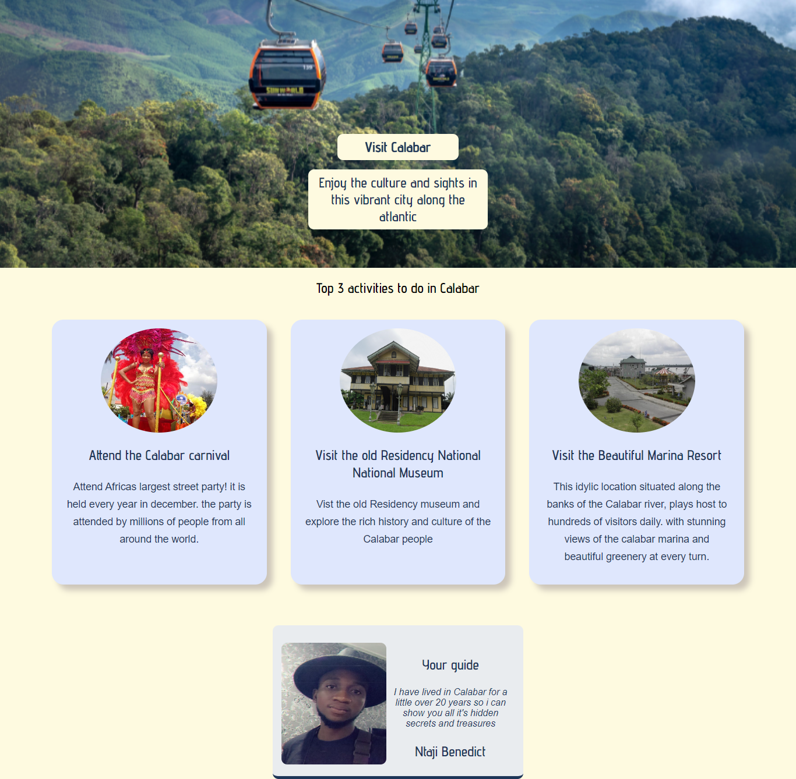

# HomeTown Tribute Page solution

This is a solution to the Scrimba assesment. 

## Table of contents

- [Overview](#overview)
  - [The challenge](#the-challenge)
  - [Screenshot](#screenshot)
  - [Links](#links)
- [My process](#my-process)
  - [Built with](#built-with)
  - [What I learned](#what-i-learned)
- [Author](#author)
- [Acknowledgments](#acknowledgments)

## Overview
After completeing the basic HTML and CSS course on [Scrimba](https://scrimba.com/learn/htmlandcss), i decided to build this HomeTown Tribute site as a test of the skills and knowlegde i have aquired from the course.

### The challenge

Users should be able to:

- Create a well designed Tribute Page of my Home town.
- Use the thing i have learnt through this couse to build the project. 

### Screenshot

### Links

- Live Site URL: [Add live site URL here](https://your-live-site-url.com)

## My process
I Startded the project by first looking at the design file provided on figma, taking into account the various design elements and choices. Then  when i was ready, i started writing the HTML part to define the basic structure of the project. i Started with the hero section, editting the hero picture to the desired size i wanted. then i proceeded to the section area and designed three cards using CSS flexbox. eventually i concluded by designing the guide Card at the bottom of the page. i used the [Coolors](https://coolors.co/) to generate the color Palettes used for this project. s
### Built with

- Semantic HTML5 markup
- CSS custom properties
- Flexbox
- Photos from [pixel](https://www.pexels.com/)
- color Palettes [Coolors](https://coolors.co/)
- CSS Box-Shadow Property

### What I learned
  
  I Learnt how to center elements ussing CSS flexbox

## Author
- Twitter [@BIG_BENNEY](https://twitter.com/BIG_BENNEY)

## Acknowledgments

I want to Thank Per Harald Borgen and all the  wonderful people at scrimba for taking time out of their busy schdule to put together this free cousre.
